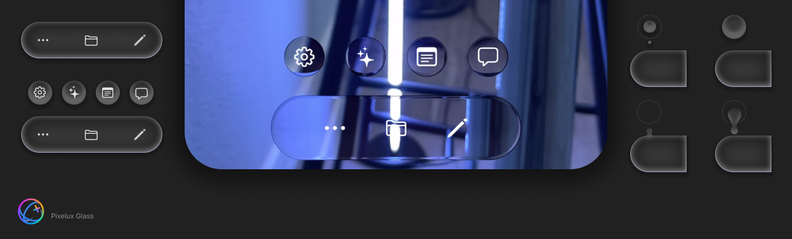

# PixeluxGlass



A SwiftUI implementation of Apple's liquid glass visual effect, specifically designed for ARKit applications. This library brings the ethereal, refractive glass aesthetic to AR experiences with real-time camera feed processing.

[](https://youtu.be/NuPVjpL2Lf4)

## See It In Action

- **Live Demo**: [cruzcortes.com/public/pages/pixelux/pixelux.html](https://cruzcortes.com/public/pages/pixelux/pixelux.html)
- **iOS App**: [Download Pixelux on App Store](https://apps.apple.com/us/app/pixelux/id6742871868)

## Features

- Real-time refractive glass effect processing
- Customizable corner radius, blur intensity, and distortion
- Interactive mode with smooth glass merging animations
- Optimized for ARKit camera frame processing
- Pure SwiftUI API with Metal shaders
- High-performance rendering at 60fps

## Requirements

- iOS 15.0+
- Swift 5.5+
- ARKit
- Metal

## Installation

**Note**: This is not distributed as a package. The source code is provided as-is for direct integration into your project.

1. Clone or download this repository
2. Copy the `src` folder into your Xcode project
3. Ensure all files are added to your target

## Project Structure

```
src/
├── ARSetup/        # AR integration examples and guides
├── Examples/       # Usage examples and demos
├── Managers/       # State management for interactive features
├── Shaders/        # Metal shader implementations
└── Views/          # SwiftUI components
```

## 🔧 ARKit Integration

PixeluxGlass requires access to ARKit camera frames. Add these to your existing `ARDelegate`:

```swift
class ARDelegate: NSObject, ARSessionDelegate, ObservableObject {
    // Required: Add this property
    @Published var currentFrame: ARFrame?
    
    // Required: Update frames in your session delegate
    func session(_ session: ARSession, didUpdate frame: ARFrame) {
        DispatchQueue.main.async {
            self.currentFrame = frame
        }
    }
}
```

For detailed setup instructions, see `src/ARSetup/PixeluxARIntegration.swift`

## Basic Usage

```swift
import SwiftUI

struct ContentView: View {
    @StateObject private var arDelegate = ARDelegate()
    
    var body: some View {
        PixeluxLiquidGlass(currentFrame: $arDelegate.currentFrame)
            .cornerRadius(40)
            .blurIntensity(0.3)
            .distortionStrength(1.2)
            .frame(width: 200, height: 200)
    }
}
```

## Customization

### View Modifiers

PixeluxGlass provides custom view modifiers to control the appearance:

#### `.cornerRadius(_ radius: CGFloat)`
Controls the corner radius of the glass shape.
```swift
PixeluxLiquidGlass(currentFrame: $arDelegate.currentFrame)
    .cornerRadius(30) // Rounded corners
    .cornerRadius(0)  // Sharp corners
```

#### `.blurIntensity(_ intensity: CGFloat)`
Sets the blur strength from 0.0 (no blur) to 1.0 (maximum blur).
```swift
PixeluxLiquidGlass(currentFrame: $arDelegate.currentFrame)
    .blurIntensity(0.0)  // Crystal clear
    .blurIntensity(0.5)  // Medium blur
    .blurIntensity(1.0)  // Maximum blur
```

#### `.distortionStrength(_ strength: CGFloat)`
Controls the refraction distortion effect.
```swift
PixeluxLiquidGlass(currentFrame: $arDelegate.currentFrame)
    .distortionStrength(0.5)  // Subtle distortion
    .distortionStrength(1.2)  // Strong refraction
    .distortionStrength(2.0)  // Maximum distortion
```

### Standard SwiftUI Modifiers

You can use any standard SwiftUI modifiers:

```swift
PixeluxLiquidGlass(currentFrame: $arDelegate.currentFrame)
    .cornerRadius(40)
    .blurIntensity(0.3)
    .distortionStrength(1.2)
    .frame(width: 320, height: 320)
    .offset(y: -80)
    .animation(.spring(response: 0.3, dampingFraction: 0.8), value: expanded)
```

## Interactive Mode

Enable interactive mode to allow glass elements to merge with fluid animations:

```swift
PixeluxLiquidGlass(currentFrame: $arDelegate.currentFrame)
    .interactive(true)
```

**Important**: For interaction to work, you need:
- At least **two** glass components with `.interactive(true)`
- Components must be animated to positions where they can collide
- See `PixeluxMainMenuExample` for a complete implementation

### Interactive Example

```swift
HStack(spacing: 20) {
    PixeluxLiquidGlass(currentFrame: $arDelegate.currentFrame)
        .cornerRadius(25)
        .interactive(true)  // Enable interaction
        .frame(width: 100, height: 100)
    
    PixeluxLiquidGlass(currentFrame: $arDelegate.currentFrame)
        .cornerRadius(25)
        .interactive(true)  // Enable interaction
        .frame(width: 100, height: 100)
}
.animation(.easeInOut, value: position)
```

When these elements move close together, they will merge smoothly like liquid.

## Examples

Check out the `Examples/` folder for complete implementations:

- **PixeluxMainMenuExample.swift** - Interactive menu with animated glass elements
- **PixeluxGlassExample.swift** - Basic usage patterns and configurations

## Troubleshooting

### Glass appears black or empty
- Verify your ARSession is running
- Check that `currentFrame` is being updated
- Ensure camera permissions are granted

### No interaction between glasses
- Confirm both elements have `.interactive(true)`
- Verify elements are close enough to interact
- Check that animations are applied for movement

### Performance issues
- Limit the number of glass instances
- Reduce blur intensity for better performance
- Disable interactive mode if not needed

## License

This project is licensed under the MIT License - see the [LICENSE](LICENSE) file for details.

## Contact

Created by Gonzalo Cruz Cortes

- LinkedIn: [linkedin.com/in/cruzcortes](https://www.linkedin.com/in/cruzcortes/)
- About The Pixelux App: [cruzcortes.com](https://cruzcortes.com/public/pages/pixelux/pixelux.html)

## Acknowledgments

Inspired by Apple's design language and the upcoming OS visual styling. This implementation is an original interpretation created for the AR community.

---

*Built with ❤️ for the AR development community*